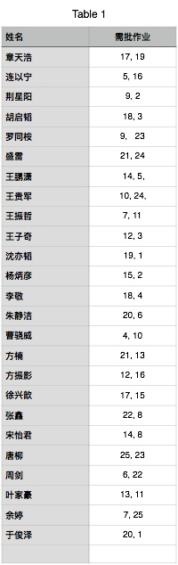
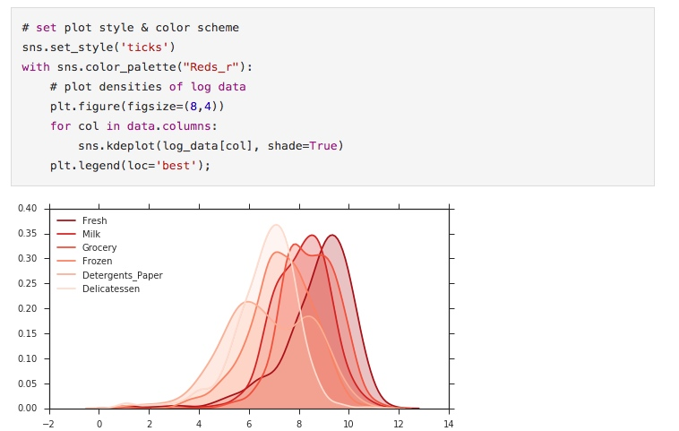
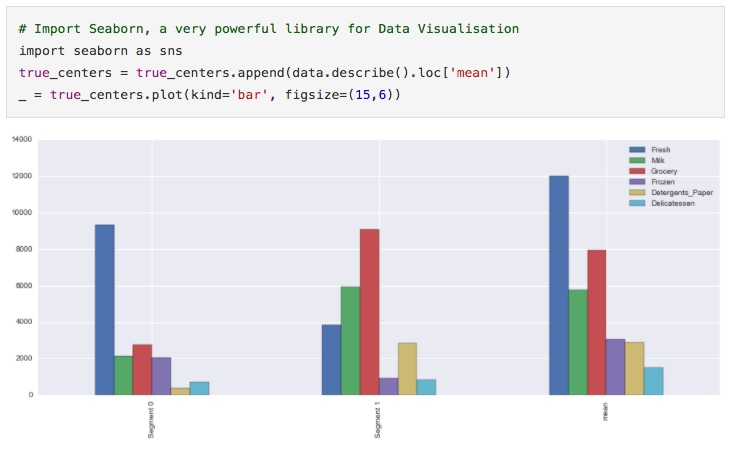

# 第四周作业互评规则
大家对每个问题的评价需要尽可能详尽，不仅要指出哪做的不好，还要说下怎么做才能更好。尽可能地引用外部知识，比如博客文章等来补充解释某一概念或者步骤。你可以贴代码来解释或补充说明某一问题。

建议你在开始自己的审阅任务前，先大致扫一下所有人的作业情况，并找到其中的亮点和缺陷，这能够帮助你更好地审阅作业。

标准解答见：[customer_segments.ipynb](https://github.com/wolegechu/Machine_Learning_Nanodegree/blob/master/3.%20Customer%20Segments/customer_segments.ipynb) (也存在一些小问题，但可以作总的参考)

评阅截止时间：8 月 17 日，周四晚 18:30
提交方式：提交 pdf 格式的文件，命名格式为 **作业编号-评阅人名字.pdf**，然后作为附件发送至邮箱 gaofei@hdu.edu.cn

大家可以在群文件中找到所有作业。每个人需要批改的作业编号见下表：

# 作业评阅样例
使用 [rubrics.md](assignment/rubrics.md) 作为模板
## 数据研究
- 问题 1 选取样本：已选取三个数据样本，提出建立表达式并给出合理解释。
    - 应该使用数据的**统计描述**比如中位数、平均值等作为理由
- 问题 2 属性相关性：准确报告被删除属性的预测分数，合理解释被删除属性是否具有相关性。
    - 对，你关于“Grocery对区分用户的消费习惯来说没有多大必要”的结论正确，但能否说出具体的理由
    - 寻找冗余的特征也是[特征选择](http://machinelearningmastery.com/an-introduction-to-feature-selection/)中很重要的一步
- 问题 3 属性分布模式：学生找出具有关联的属性并将其与预测属性相比较，随后深入讨论这些属性的数据分布模式。
    - 对～
    - 散布矩阵（scatter matrix）可以让我们看出不同特征之间的关联性，`data.corr()` 可以生成一张关于这些关联性的统计数值表，你可以尝试下。

## 数据处理
- 特征缩放：数据和样本的特征缩放已在代码中正确实施。
    - 符合要求，在这里，你也可以使用 [seaborn KDE plot](http://seaborn.pydata.org/tutorial/distributions.html) 比较所有这些经过 log 变化之后的分布，代码以及效果图如下：

- 问题 4 异常检测：学生找出极端的异常值，讨论是否删除这些异常值，并说明删除各数据点的理由。
    - 符合要求

## 属性转换
- 问题 5：准确报告主要成分分析数据的二个维度与四个维度的总方差。将前四个维度合理解释为对消费者支出的表达。
    - 基本符合要求
    - 每个维度的信息来自商品信息，比如第一个维度中，Detergents_paper, Milk 和 Grocery 同正向，可以一定程度上代表零售物品
    - 在每个维度中，原始特征权重的绝对值越大，代表这一特征对该维度的影响更大，请具体说明理由。
- 降维：对二维缩放数据及样本数据的主要成分分析已在代码中正确实施。
    - 符合要求

## 聚类
- 问题 6 聚类算法：高斯混合模型和K-均值算法已进行详细比较。学生选择的算法符合算法和数据的特点。
    - K-Means 聚类算法还有一个很大的缺点是它假定了分组的的形状是圆形对称的，但真实数据往往不是这样；GMM 则是假定数据符合高斯分布，与真实情况更相符。
- 问题 7 创建集群：准确报告多个轮廓分数，根据报告的最佳分数选择最佳集群数量。已给出的集群视觉化将根据已选的聚类算法生成最佳的集群数量。
    - 符合要求
- 问题 8 数据恢复：根据数据集的统计描述提出每个客户细分所代表的类型。对集群中心的逆变换和反比例级联已在代码中正确实施。
    - 像问题 1 一样，这里你也应该使用数据的具体统计描述数值来分析，而不是泛泛而谈
    - 这里你也可以尝试可视化每一聚类中心采购的商品数，代码如下：

- 问题 9 样本预测：客户细分正确识别样本数据点，讨论各样本数据点的预测集群。
    - 符合要求
    - 但应该给出更具体的解释，如 对于样本点 0，Grocery, Milk 和 Detergents_paper 的值都高于平均值，这反应了 XX 聚类中心的特点，所以 XXX。

## 结论
- 问题 10 A/B 测试：提出了某些功能改进方法，可以改进从 A/B 测试获取结果的功能。
    - 符合要求
    - 如果感兴趣的话，你可以进一步阅读下列文章了解 A/B 测试的实际应用
        - [When A/B testing shouldn't be trusted](https://www.quora.com/When-should-A-B-testing-not-be-trusted-to-make-decisions/answer/Edwin-Chen-1)
        - [Pitfalls of A/B testing](https://www.oreilly.com/ideas/evaluating-machine-learning-models/page/6/the-pitfalls-of-a-b-testing)
- 问题 11 预测额外属性：学生讨论了聚类数据如何可以通过监督学习预测新的属性。
    - 符合要求
- 问题 12 比较客户数据：客户细分与客户通道数据进行对比，对通道数据识别客户细分的问题进行讨论，包括该表达是否符合早期结果。
    - 符合要求
    - 选择的 GMM 效果不错，我们可以看到两种类被一条基本垂直的线分割

